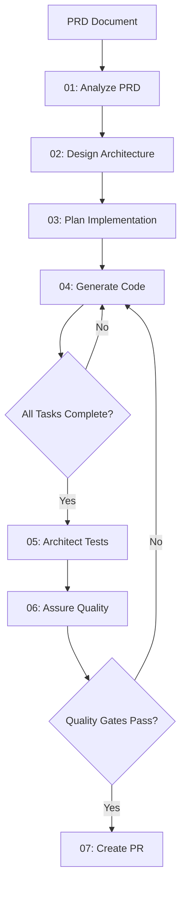

# DT - Developer Tools for Claude Code

A comprehensive collection of enterprise-grade Claude Code commands and agents for software developers. These tools implement advanced AI techniques including Tree of Thoughts, Chain of Draft, and Sequential Thinking to provide intelligent, proactive development assistance.

## 🚀 Quick Start

1. **Copy the commands to your Claude Code directory:**
   ```bash
   cp -r dt ~/.claude/commands/
   # (exclude .git folder)
   ```

2. **Start using the tools immediately:**
   ```bash
   # Generate git commits with intelligent analysis
   /dt:generate:commit

   # Execute complete enterprise workflow from PRD to PR
   /dt:workflow:enterprise-workflow path/to/prd.md

   # Brainstorm and critique ideas
   /dt:utilities:brainstorm "my product idea"
   ```

## 📁 Command Categories

### 🔄 Workflow Commands (01-07)
Enterprise development workflow that takes you from PRD to production-ready PR:

- **`/dt:workflow:01-analyze-prd`** - Analyze Product Requirements using Tree of Thoughts reasoning
- **`/dt:workflow:02-design-architecture`** - Design enterprise architecture with Chain of Thoughts
- **`/dt:workflow:03-plan-implementation`** - Plan atomic implementation with Chain of Draft methodology
- **`/dt:workflow:04-generate-code`** - Execute project-specific validation with enterprise quality gates
- **`/dt:workflow:05-architect-tests`** - Design comprehensive testing using discovered frameworks
- **`/dt:workflow:06-assure-quality`** - Execute quality assurance with discovered quality tools
- **`/dt:workflow:07-create-pr`** - Create atomic pull requests with Chain of Draft optimization

#### 🔍 Workflow Utilities
- **`/dt:workflow:enterprise-workflow`** - Execute complete workflow chain (PRD → PR)
- **`/dt:workflow:check-progress`** - Analyze workflow state and recommend next actions

#### 🔧 Supporting Workflow Commands
- **`/dt:workflow:03.5a-detect-ecosystem`** - Auto-detect project technology stack
- **`/dt:workflow:03.5b-research-standards`** - Research industry standards for detected ecosystem
- **`/dt:workflow:03.5c-generate-gates`** - Generate executable quality gates from research
- **`/dt:workflow:04.5-validate-task-completion`** - Continuous validation with fail-fast quality gates

### ⚙️ Generation Commands
AI-powered code and configuration generators:

- **`/dt:generate:agent`** - Generate Claude Code agents following documentation best practices
- **`/dt:generate:command`** - Create sophisticated commands with advanced prompt engineering
- **`/dt:generate:commit`** - Intelligent git commit analyzer with conventional commits
- **`/dt:generate:hook`** - Generate Claude Code hooks with security validation

### 🧠 Utilities
Specialized assistance tools:

- **`/dt:utilities:brainstorm`** - Interactive idea development with honest critique
- **`/dt:utilities:build-prd`** - Comprehensive product strategy assistant with dynamic expertise

## 🏗️ How the Enterprise Workflow Works

The workflow commands work together to implement a complete enterprise development process:



### Key Workflow Features

**🧠 Advanced AI Reasoning:**
- **Tree of Thoughts** for requirement analysis and testing strategy
- **Chain of Thoughts** for architectural decision making
- **Chain of Draft** for iterative code improvement
- **Sequential Thinking** for complex problem solving

**🔍 Discovery-Based Execution:**
- Auto-detects project technology stack and tools
- Discovers existing quality tools (linters, formatters, test frameworks)
- Generates project-specific quality gates
- No hardcoded assumptions about your project

**📊 Modular State Management:**
- Tracks progress across `.workflow/` directory structure
- Maintains state between command executions
- Enables workflow resumption and progress checking
- Provides comprehensive progress reporting

**⚡ Enterprise Quality Gates:**
- Fail-fast validation at each step
- 85%+ test coverage requirements
- Zero linting errors policy
- Security scanning integration
- Performance benchmarking

## 📖 Usage Examples

### Complete Enterprise Workflow
```bash
# Start with a PRD and get a production-ready PR
/dt:workflow:enterprise-workflow requirements/feature.md

# Or run step by step:
/dt:workflow:01-analyze-prd requirements/feature.md
/dt:workflow:02-design-architecture .workflow/core/workflow-core.json .workflow/requirements/requirements.json
# ... continue through the chain
```

### Check Workflow Progress
```bash
# Get comprehensive progress report
/dt:workflow:check-progress

# Get detailed task breakdown
/dt:workflow:check-progress detailed
```

### Generate Intelligent Commits
```bash
# Analyze changes and create conventional commits
/dt:generate:commit

# Output example:
# feat(auth): implement OAuth2 integration with Google
# test(auth): add comprehensive OAuth2 test suite
# docs(auth): document OAuth2 configuration and setup
```

### Create Custom Tools
```bash
# Generate a new specialized agent
/dt:generate:agent "React component optimization specialist"

# Create a sophisticated command
/dt:generate:command "analyze database performance" --complexity=expert

# Generate security hooks
/dt:generate:hook "validate all bash commands for security"
```

### Product Strategy Assistant
```bash
# Interactive strategy development
/dt:utilities:build-prd "AI-powered code review platform" --mode=strategy

# Discovery mode for unclear requirements
/dt:utilities:build-prd "some fintech idea" --mode=discovery

# Idea validation and critique
/dt:utilities:brainstorm "subscription management for SaaS"
```

## 🎯 Key Principles

All tools follow enterprise development principles:

- **SLON** (Simple, Lean, One-thing, No overengineering)
- **KISS** (Keep It Simple, Stupid)
- **YAGNI** (You Aren't Gonna Need It)
- **DRY** (Don't Repeat Yourself)
- **Fail-fast validation** with clear error messages
- **Modular architecture** for maintainability
- **Discovery-based execution** - no hardcoded assumptions

## 🔧 Advanced Features

### Proactive Intelligence
Commands don't just execute tasks - they:
- Anticipate user needs and provide suggestions
- Identify potential issues before they occur
- Recommend optimizations and improvements
- Learn from project patterns and context

### Quality Assurance
- **Continuous validation** at every step
- **Enterprise-grade quality gates**
- **Security-first approach** with validation
- **Performance monitoring** and optimization
- **Comprehensive error handling** and recovery

### Collaboration Features
- **Atomic PR generation** for clean review process
- **Comprehensive documentation** generation
- **Team-friendly workflows** with clear handoffs
- **Progress tracking** for project visibility

## 📁 File Structure After Installation

```
~/.claude/commands/dt/
├── generate/
│   ├── agent.md              # Agent generator
│   ├── command.md            # Command generator
│   ├── commit.md             # Git commit intelligence
│   └── hook.md               # Hook generator
├── utilities/
│   ├── brainstorm.md         # Idea development
│   └── build-prd.md          # Product strategy
├── workflow/
│   ├── 01-analyze-prd.md     # PRD analysis
│   ├── 02-design-architecture.md
│   ├── 03-plan-implementation.md
│   ├── 04-generate-code.md   # Code generation
│   ├── 05-architect-tests.md # Test design
│   ├── 06-assure-quality.md  # Quality gates
│   ├── 07-create-pr.md       # PR creation
│   ├── check-progress.md     # Progress tracking
│   ├── enterprise-workflow.md # Full workflow
│   └── [supporting commands...]
└── refs/
    └── command-and-agents.md  # Documentation
```

## 🚨 Important Notes

**Quality First:**
- All workflow commands enforce enterprise quality standards
- Zero tolerance for failing tests or linting errors
- Security validation at every step
- Performance benchmarking integrated

**Discovery-Based:**
- Commands auto-detect your project setup
- No hardcoded tool assumptions
- Works with any technology stack
- Adapts to your existing workflow

**Modular & Resumable:**
- Workflow state persisted across executions
- Resume from any point in the process
- Independent command execution supported
- Progress tracking and reporting

## 🤝 Integration

These commands integrate seamlessly with:
- Any git workflow and branching strategy
- Existing CI/CD pipelines
- Popular development tools and frameworks
- Team collaboration processes
- Enterprise security and compliance requirements

## 🆘 Getting Help

- **Progress Check:** `/dt:workflow:check-progress` - See current workflow state
- **Command Reference:** All commands include detailed help and examples
- **Workflow Recovery:** Commands provide specific guidance when issues occur
- **Quality Debugging:** Comprehensive error messages with fix suggestions

---

**Ready to transform your development workflow?** Copy the `dt` folder to `~/.claude/commands/` and start with `/dt:workflow:enterprise-workflow` or `/dt:generate:commit` to experience intelligent, proactive development assistance.